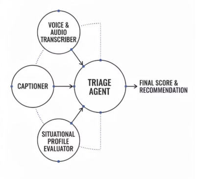
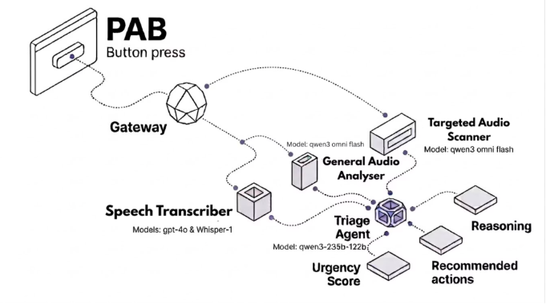
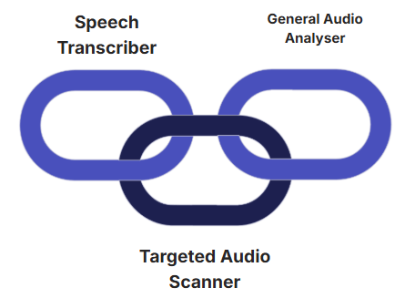
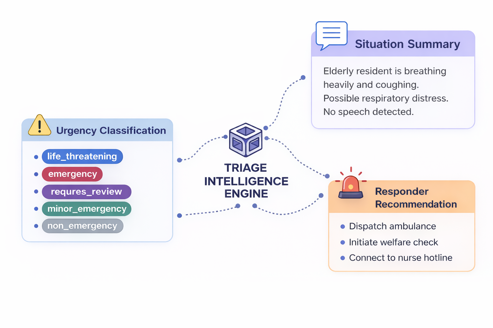
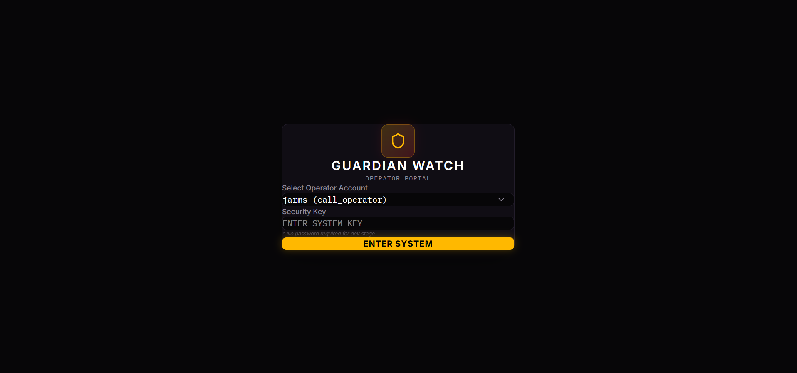
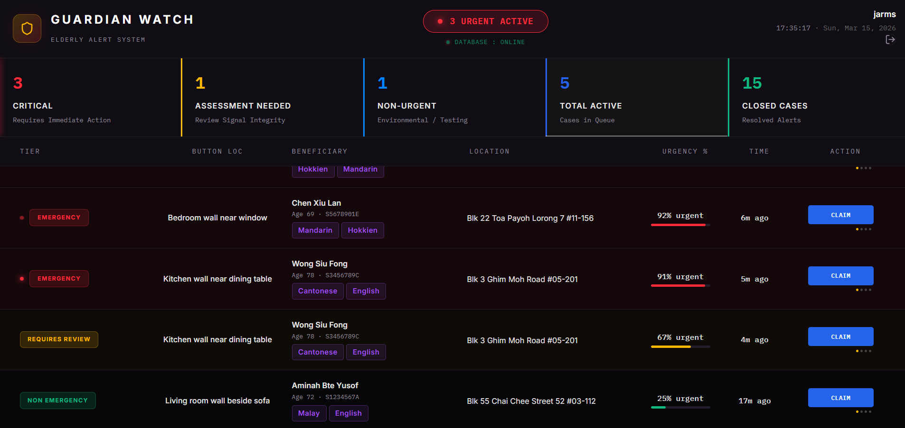
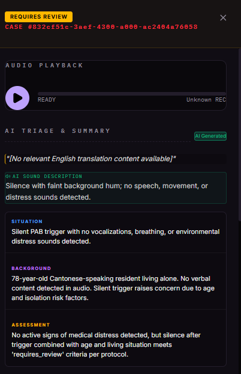
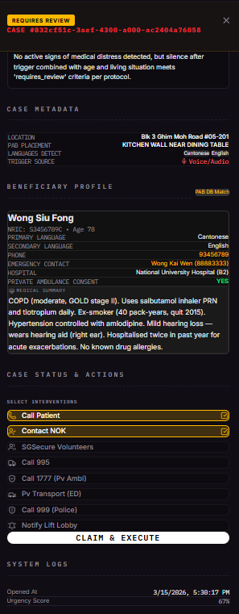
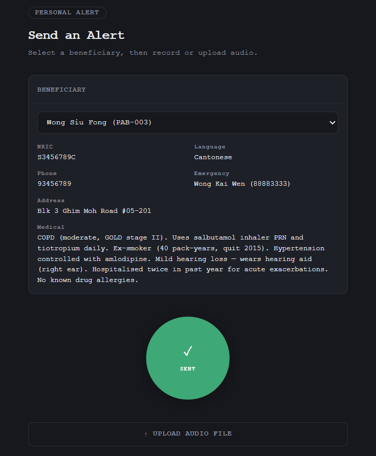

# JARMS

AI-Assisted Emergency Audio Triage System

JARMS enhances Personal Alert Button (PAB) emergency systems used by elderly residents living alone.  
The system analyzes audio alerts using multiple AI agents and converts them into structured emergency insights to support responders.

---

# The Challenge

## Problem Statement

How might we use AI to enhance the PAB system so that hotline responders can more accurately understand the senior's situation, assess urgency, and allocate resources effectively?

4 key notes:
| Key Design Principles | Why It Matters                                                                                     |
| --------------------- | -------------------------------------------------------------------------------------------------- |
| Speed                 | Every second wasted not allocating resources could be severe                                       |
| Accuracy              | Responders need accurate context and situation assessment, not just an alert signal                |
| Resource Allocation   | The right help must reach the right person at the right time                                       |
| Prioritisation        | Not all cases are equal, the system must rank urgency to prevent critical cases from being delayed |

PAB systems typically provide very limited context.

Responders receive:

- a button trigger
- a short audio recording

However emergency audio often contains:

| Challenge           | Description                                                    |
| ------------------- | -------------------------------------------------------------- |
| Noise               | Background sounds obscure speech                               |
| Multilingual speech | Residents may speak dialects such as Hokkien, Cantonese, Malay |
| Incomplete speech   | Residents may be unable to clearly describe symptoms           |
| Non-verbal distress | Breathing problems or falls may occur without speech           |
| Code Switch         | Using multiple languages in 1 sentence (Hokkien and English)   |

These issues slow emergency response decision making.

---

# SCDF Context

Singapore emergency response workflows commonly follow **SCDF urgency triage categories**.

JARMS aligns with this framework and introduces one additional safety category.

| JARMS Priority   | SCDF Alignment  | Meaning                    |
| ---------------- | --------------- | -------------------------- |
| life_threatening | Highest acuity  | Immediate danger to life   |
| emergency        | High acuity     | Serious urgent case        |
| requires_review  | JARMS extension | Ambiguous audio signals    |
| minor_emergency  | Lower urgency   | Medical attention required |
| non_emergency    | Low urgency     | Stable situation           |

The `requires_review` category ensures unclear signals are escalated for human evaluation.

---

# System Overview

JARMS processes audio using **parallel AI agents** and a **central triage engine**.



Each agent analyzes a different aspect of the audio signal.

Their outputs converge into a **triage intelligence engine** that generates the final emergency assessment.

---

# Under the Hood Architecture



---

# Parallel AI Agents

The moment a PAB alert triggers, all AI agents start simultaneously.

This avoids sequential model bottlenecks and reduces response latency.



| Agent                      | Old Name               | Function                             | Example Signals             |
| -------------------------- | ---------------------- | ------------------------------------ | --------------------------- |
| Speech Intelligence        | Speech Transcriber     | Speech transcription and translation | spoken symptoms             |
| Situational Audio Analysis | General Audio Analyser | Emotional and distress detection     | crying, panic               |
| Acoustic Event Detection   | Targeted Audio Scanner | Medical signal detection             | breathing difficulty, falls |

---

# Triage Intelligence Engine

Once all agents complete analysis, their outputs are merged by the **Triage Agent**.



The engine generates three outputs.

| Output                  | Description                       |
| ----------------------- | --------------------------------- |
| Urgency Categorization  | Severity classification           |
| Situation Summary       | AI explanation of detected events |
| Resource Recommendation | Suggested responder action        |

---

# Impact of JARMS

| Metric                                    | Result      |
| ----------------------------------------- | ----------- |
| Response interpretation speed (Projected) | ~90% faster |
| Responder cognitive load                  | Reduced     |
| Average processing time                   | ~20 seconds |

---

# Operator Dashboard (UI)

JARMS includes a real-time responder dashboard.

## Login Interface



---

## Emergency Queue Dashboard



### Features:

| Feature                  | Description                                                            |
| ------------------------ | ---------------------------------------------------------------------- |
| Live case queue          | Constantly listens to Supabase case changes and refreshes from backend |
| Realtime resilience      | Auto reconnect + polling fallback when realtime channel is unstable    |
| Queue prioritization     | Sorted by urgency tier, then queue score, then recency                 |
| Operator workflow        | Claim, execute/dispatch, resolve, with operator assignment persisted   |
| Processing visibility    | Cases appear while AI triage is still running (`processing`)           |
| Filtered operations view | Active / urgent / med / low / closed views with stats bar              |

---

## Case Detail View




Displays full triage results including:

- transcript
- audio-captioned scene summary
- triage flags / distress indicators
- SBAR (situation, background, assessment)
- urgency classification
- recommended actions
- beneficiary context and medical summary

---

## Alert Simulation Tool



Used for testing emergency scenarios and validating AI pipeline behavior.

---

# Technology Stack

| Layer           | Technology                 |
| --------------- | -------------------------- |
| Backend         | FastAPI                    |
| Frontend        | React                      |
| Database        | Supabase PostgreSQL        |
| Realtime events | Supabase Realtime          |
| AI inference    | OpenAI + Alibaba DashScope |

---

# AI Models

| Model            | Provider | Role                           |
| ---------------- | -------- | ------------------------------ |
| whisper-1        | OpenAI   | speech transcription           |
| gpt-4o           | OpenAI   | transcript cleanup             |
| qwen3-omni-flash | Alibaba  | audio signal detection         |
| qwen3-235b-a22b  | Alibaba  | triage reasoning               |
| gpt-4o-realtime  | OpenAI   | realtime nurse assistant (WIP) |

---

# Case Lifecycle

```
processing → new → claimed → dispatched → resolved
```

| State      | Meaning                            |
| ---------- | ---------------------------------- |
| processing | AI pipeline running                |
| new        | awaiting responder                 |
| claimed    | responder assigned                 |
| dispatched | response plan executed by operator |
| resolved   | case closed                        |

---

# Database Schema (Core Tables)

The backend currently relies on the following core Supabase tables.

## `cases`

Primary operational table storing each alert/case lifecycle.

Key fields used by backend/frontend:

- `case_id` (string UUID)
- `nric` (beneficiary link)
- `button_id`
- `status` (`processing`, `new`, `claimed`, `dispatched`, `resolved`, plus WIP nurse-bot statuses)
- `urgency_bucket` (`life_threatening`, `emergency`, `requires_review`, `minor_emergency`, `non_emergency`)
- `queue_score` (numeric)
- `source` (for current flow, typically `pab_audio`)
- `transcript_raw`, `transcript_english`
- `audio_caption_text`
- `triage_flags` (array)
- `recommended_actions` (array)
- `sbar_json` (json)
- `audio_file_url`, `audio_duration_seconds`, `audio_uploaded_at`
- `opened_at`, `closed_at`, `updated_at`
- `assigned_operator_id`

## `pab_beneficiaries`

Resident profile and context used by triage and UI.

Frequently consumed fields:

- `nric`, `full_name`, `button_id`
- `primary_language`, `secondary_language`
- `address`, `unit_number`
- `phone_number`
- `emergency_contact_name`, `emergency_contact`
- `patient_medical_summary`
- optional medical/operational context: `dnr_status`, `consent_private_ambulance`, etc.

## `operators`

Operator identity used for login/session and assignment.

Commonly used fields:

- `operator_id`
- `username`
- `role`

---

# JSON Schemas (Data Contracts)

These are practical data contracts used between client, backend, and database mapping.

## 1) Audio Ingestion Request (`POST /cases/audio`)

Content type: `multipart/form-data`

```json
{
  "button_id": "PAB-001",
  "audio": "<binary audio file>"
}
```

## 2) Audio Ingestion Response (simplified)

```json
{
  "message": "Audio uploaded and case created",
  "case": {
    "case_id": "uuid",
    "status": "processing",
    "urgency_bucket": "requires_review",
    "queue_score": 0
  },
  "beneficiary": {
    "nric": "S1234567A",
    "full_name": "Resident Name",
    "primary_language": "english"
  },
  "triage_pipeline_result": {},
  "triage_pipeline_error": null
}
```

## 3) Cases List Response (`GET /cases/`)

```json
{
  "items": [
    {
      "case_id": "uuid",
      "status": "new",
      "urgency_bucket": "emergency",
      "queue_score": 82,
      "sbar_json": {
        "situation": "...",
        "background": "...",
        "assessment": "..."
      },
      "triage_flags": ["gasping_or_laboured_breathing"],
      "recommended_actions": ["call_995"],
      "full_name": "Resident Name",
      "address": "...",
      "unit_number": "..."
    }
  ]
}
```

## 4) Frontend-Internal Normalized Alert Shape (`mapCase`)

```json
{
  "id": "case_id",
  "tier": "urgency_bucket",
  "actionState": "status",
  "queue_score": 82,
  "location": "Address Unit",
  "button_location": "Living Room",
  "transcript": "transcript_english",
  "audio_caption_text": "...",
  "triage_flags": ["..."],
  "recommended_actions": ["..."],
  "sbar": {
    "situation": "...",
    "background": "...",
    "assessment": "..."
  },
  "beneficiary": {
    "nric": "...",
    "full_name": "...",
    "phone_number": "..."
  }
}
```

## 5) Realtime Trigger Event (Supabase `cases` table)

```json
{
  "event": "INSERT | UPDATE",
  "schema": "public",
  "table": "cases"
}
```

On each event, frontend re-fetches `GET /cases/` as source of truth.

---

# Repository Structure

```
.
├── backend
│   ├── core
│   ├── routers
│   ├── services
│   │   ├── triage
│   │   └── nurse_bot
│   ├── test
|   ├── .env
|   ├── policy.json
|   ├── myproject.toml
|   ├── uv.lock
│   └── main.py
│
├── frontend
│   ├── src
│   │   ├── components
│   │   ├── hooks
│   │   ├── pages
│   │   ├── services
│   │   ├── store
|   |   ├── App.jsx
|   |   ├── index.css
|   |   └── main.jsx
│   │
│   ├── .env
│   ├── index.html
|   └── vite.config.js
│
├── docs
|    ├── diagrams
|    └── ui
└── README.md
```

---

# Quick Start

Backend

```bash
cd backend
uv sync
uv run fastapi dev
```

Frontend

```bash
cd frontend
npm install
npm run dev
```

---

# Limitations And Tradeoffs

| Area                            | Type                | Notes                                                    |
| ------------------------------- | ------------------- | -------------------------------------------------------- |
| Real emergency audio coverage   | Limitation          | Dataset diversity still limited for rare edge conditions |
| Noisy/overlapping audio         | Limitation          | Heavy noise can reduce signal quality                    |
| Human-in-loop `requires_review` | Safety feature      | Prevents unsafe auto-downgrade on ambiguous cases        |
| Parallel 3-agent design         | Performance feature | Reduces latency versus sequential model execution        |

---

# Future Improvements

- real-time AI conversation with residents
- improved fall detection models
- multilingual speech detection
- responder feedback training loop
- AI pipeline monitoring

---

# HackOMania 2026

JARMS was developed during **HackOMania 2026** within 24 hours to explore how AI can enhance emergency response systems for elderly residents using Personal Alert Buttons.

## Team Members

| Name          | Task                                  |
| ------------- | ------------------------------------- |
| Jun Kai       | Triage, Database & API                |
| Mervyn Chiong | Training AI Models                    |
| Sean Young    | UIUX, State Management & Live updates |
| Regine Yap    | Brainstormer & Vibe Coder             |
